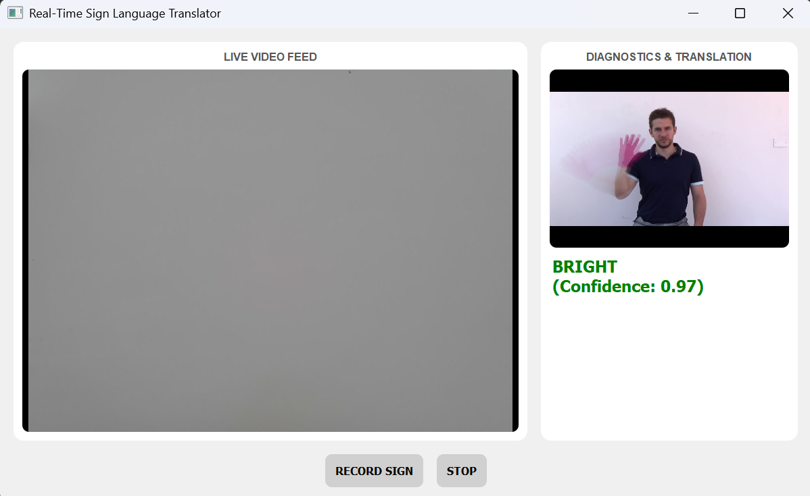

# Real-Time Argentinian Sign Language Translator



This project is a real-time sign language translator that recognizes isolated signs from the LSA64 Argentinian Sign Language dataset. It implements the two-stream fused network architecture proposed by H. Luqman in his 2022 paper, "An Efficient Two-Stream Network for Isolated Sign Language Recognition Using Accumulative Video Motion."

The application features a user-friendly interface built with PyQt5 and provides two modes of operation: a real-time translation mode using a live webcam feed and a test mode that runs on pre-recorded sample videos to demonstrate the model's accuracy under ideal conditions.

---

## Features

- **Two-Stream Deep Learning Model:** Fuses a Dynamic Motion Network (DMN) for temporal features and an Accumulative Motion Network (AMN) for spatial features.
- **Real-Time Translation:** Captures a 3-second video clip from a webcam and predicts the sign.
- **High-Fidelity Test Mode:** Allows users to test the model's performance on included sample videos, guaranteeing a reproducible, high-accuracy demonstration.
- **Intuitive GUI:** A clean interface built with PyQt5 that displays the live feed, diagnostic images (AVM), and the final translation.
- **Modular Codebase:** The training pipeline (Kaggle Notebook) and the application logic are separated for clarity.

---

## Architecture Overview

The core of this project is the **Sign Recognition Network (SRN)**, which is a fusion of two distinct streams:

1.  **Dynamic Motion Network (DMN):** A sequence of frames from a sign video is passed through a pre-trained Xception CNN to extract features. These feature sequences are then fed into a GRU/LSTM network to learn the temporal patterns of the sign's motion.
2.  **Accumulative Motion Network (AMN):** All frames of a sign video are summed and normalized into a single "motion trail" image called an Accumulative Video Motion (AVM). This AVM image is fed into a pre-trained MobileNetV2 to learn the overall spatial shape and trajectory of the sign.
3.  **Fusion:** The outputs from both the DMN and AMN streams are concatenated and passed through a final classification head to produce the final prediction, leveraging both temporal and spatial information.

---

## Project Structure
```

.
├── assets/
│ └── app_screenshot.png
├── sample_videos/
│ └── 001_001_001.mp4
│ └── ...
├── Full_DMN_AMN_SRN_Training.ipynb
├── main_app.py
├── test_app.py
├── requirements.txt
├── amn_model.h5
├── dmn_model.h5
├── srn_model.h5
└── README.md

```

---

## Setup & Installation

**Prerequisites:** Python 3.8+, Git, and Git LFS.

**1. Clone the repository:**
```bash

git clone https://github.com/Aryaman-Jaiswal/-real-time-sign-language-translator
cd -real-time-sign-language-translator

```
**2. Set up a Python virtual environment (recommended):**

```bash
# For macOS/Linux
python3 -m venv venv
source venv/bin/activate

# For Windows
python -m venv venv
.\venv\Scripts\activate
```

**3. Install Git LFS and download the large model files:**
This is a crucial step, as the model files are too large for standard Git.

```bash
# First-time setup for Git LFS
git lfs install

# Pull the large files from the repository
git lfs pull
```

**4. Install the required Python libraries:**

```bash
pip install -r requirements.txt
```

---

## How to Run

There are two ways to run the application.

### 1\. Test Mode (Recommended for Demonstration)

This mode runs the application on a pre-recorded sample video to showcase the model's accuracy under ideal, controlled conditions.

To run, simply execute the `test_app.py` script:

```bash
python test_app.py
```

The application will launch, and you can click the "RECORD SIGN" button to process one of the sample videos.

### 2\. Live Webcam Mode

This mode uses your live webcam feed for translation.

**⚠️ Important Note on Real-Time Performance:**

The model was trained on the LSA64 dataset, which has a very specific look: signers wearing **high-contrast colored gloves** against a **plain, neutral background**. For the best results, you must try to replicate these conditions:

- **Wear a Glove:** Use a solid, brightly colored glove (e.g., red, blue, green). This helps the model distinguish your hand from the background.
- **Use a Plain Background:** Position yourself in front of a neutral, single-color wall. Avoid complex backgrounds with furniture, windows, or patterns.
- **Use Good Lighting:** Ensure you are well-lit from the front. Avoid having bright lights or windows behind you.

To run the live application, execute the `main_app.py` script:

```bash
python main_app.py
```

Click **START** to begin the video feed, then position yourself correctly and click **RECORD SIGN** to capture and translate a sign.

---

## Training

The model was trained in the `Full_DMN_AMN_SRN_Training.ipynb` notebook on Kaggle, which requires the [LSA64 (Cut Version) dataset](https://facundoq.github.io/datasets/lsa64/). The notebook contains the complete end-to-end pipeline, from video preprocessing to the final training of the fused SRN.

## Acknowledgements

- This project is an implementation of the architecture described in "An Efficient Two-Stream Network for Isolated Sign Language Recognition Using Accumulative Video Motion" by H. Luqman, published in IEEE Access, 2022.

<!-- end list -->

